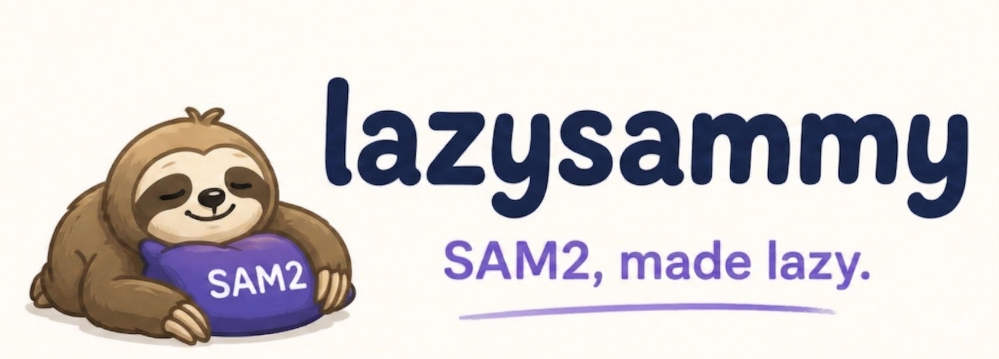

<p align="center">
  
</p>

<p align="center">
  <a href="LICENSE"></a>
  
  
  
  <a href="https://github.com/facebookresearch/sam2"></a>
  
</p>

# lazysammy

A clean, high-level wrapper around [Meta's SAM 2](https://github.com/facebookresearch/sam2) for **image segmentation** and **video object tracking**.

`lazysammy` helps you go from prompts to usable masks in minutes, not hours.

## Table of contents

- [Motivation](#motivation)
- [Installation](#installation)
- [Quick start](#quick-start)
- [Core workflows](#core-workflows)
- [API at a glance](#api-at-a-glance)
- [Advanced usage](#advanced-usage)
- [Notebooks and Demo](#notebooks-and-demo)
- [Development](#development)
- [License](#license)

---

## Motivation

SAM 2 provides excellent model capabilities, but integrating it repeatedly across notebooks and small applications often introduces unnecessary implementation overhead.

`lazysammy` is designed to reduce that overhead with a coherent, typed, and easy-to-learn API.

### What you get

- **One entry point**: `SAM2` covers image, video, and auto-mask generation
- **Typed outputs**: predictable return types (`ImagePrediction`, `VideoResults`, `AutoMaskResult`)
- **Prompt ergonomics**: point/box/mask prompts + iterative refinement
- **Easy export**: PNG, `.npy`, COCO RLE in one line
- **Portable runtime**: CUDA, Apple MPS, and CPU

### Practical benefits

- Faster iteration for experiments and personal projects
- Less repeated glue code across scripts and notebooks
- More readable code through consistent object-oriented return types

---

## Installation

This project uses [uv](https://docs.astral.sh/uv/) for dependency management.

```bash
git clone https://github.com/federicopozzi33/easier-sam2.git
cd easier-sam2
uv sync
```

Optional extras:

```bash
# matplotlib visualization helpers
uv sync --extra viz

# gradio demo
uv sync --extra demo

# linting + tests + type checks
uv sync --extra dev
```

> SAM 2 is installed from the official repository. CUDA is recommended for performance, but MPS and CPU are fully supported.

---

## Quick start

Start with the minimal calls for the three most common tasks.

```python
from lazysammy import SAM2

sam = SAM2("large")
```

### Segment an image

```python
pred = sam.segment("photo.jpg", points=[[100, 200]], labels=[1])
print(pred.best_mask.score)
pred.best_mask.save("mask.png")
```

### Track objects in video frames

```python
session = sam.video("path/to/frames/")
session.add_points(frame_idx=0, obj_id=1, points=[[150, 300]], labels=[1])
results = session.propagate()
session.save("output/video_masks/")
```

### Auto-segment everything

```python
auto = sam.auto_segment("photo.jpg")
good = auto.filter_by_iou(min_iou=0.9)
good.save("output/auto_masks/")
```

---

## Core workflows

These patterns cover day-to-day usage once you move beyond the first quick-start calls.

### Image workflows

Use these helpers when you need more control over prompts and refinement.

```python
# Box prompts
pred = sam.segment("photo.jpg", box=[50, 60, 300, 400])

# Convenience shortcuts
pred = sam.segment_point("photo.jpg", x=100, y=200)
pred = sam.segment_box("photo.jpg", 50, 60, 300, 400)

# Multi-object segmentation (one box each)
preds = sam.segment_multi_box(
    "photo.jpg",
    boxes=[[50, 60, 300, 400], [400, 100, 600, 350]],
)

# Iterative refinement using previous logits
pred1 = sam.segment_point("photo.jpg", x=100, y=200)
pred2 = sam.refine(
    "photo.jpg",
    pred1.best_mask.logits,
    points=[[120, 180]],
    labels=[0],
)
```

### Video workflows

Keep this baseline flow simple: one object, one prompt, one propagation pass.

```python
session = sam.video("path/to/frames/")

# Add a single object prompt
session.add_points(frame_idx=0, obj_id=1, points=[[150, 300]], labels=[1])

# Forward propagation (typical when earliest prompt is near frame 0)
results = session.propagate()

# If your earliest prompt is in the middle of the video, prefer:
# results = session.propagate_bidirectional()

# Access by frame/object
obj1_masks = results.get_object_masks(obj_id=1)

# Update session state
session.remove_object(obj_id=1)
session.reset()
```

---

## API at a glance

Quick reference for the primary objects and return types.

| Area | Main call | Returns |
|------|-----------|---------|
| Image segmentation | `sam.segment(...)` | `ImagePrediction` |
| Video session | `sam.video(...)` | `VideoSession` |
| Video propagation | `session.propagate(...)` | `VideoResults` |
| Auto-segmentation | `sam.auto_segment(...)` | `AutoMaskResult` |
| Save image outputs | `save_image_prediction(...)` | output path |
| Save video outputs | `save_video_results(...)` | output path |

---

## Advanced usage

Use these patterns for larger experiments and more customized workflows.

### Model and device options

Control model scale, checkpoint source, runtime device, and performance mode.

```python
# Aliases and model IDs
sam = SAM2("large")   # also: tiny, small, base_plus
sam = SAM2("l")
sam = SAM2("b+")

# Local checkpoint
sam = SAM2("large", checkpoint="/path/to/sam2.1_hiera_large.pt")

# Explicit device
sam = SAM2("large", device="cuda:1")
sam = SAM2("large", device="mps")
sam = SAM2("large", device="cpu")

# Video-optimized mode (CUDA + PyTorch >= 2.5.1)
sam = SAM2("large", vos_optimized=True)
```

### Multi-object tracking example

This example tracks multiple objects with different prompt types and a mid-sequence correction.

```python
from lazysammy import SAM2

sam = SAM2("large")
session = sam.video("path/to/frames/")

# Annotate person at frame 0
session.add_points(
  frame_idx=0,
  obj_id=1,
  points=[[220, 340], [250, 300]],
  labels=[1, 1],
)

# Annotate bike at frame 0 with a box
session.add_box(
  frame_idx=0,
  obj_id=2,
  box=[410, 220, 590, 470],
)

# Add a correction click for person at frame 12
session.add_points(
  frame_idx=12,
  obj_id=1,
  points=[[205, 355]],
  labels=[0],
  clear_old=False,
)

# Because prompts exist near the start, forward propagation is typically enough
results = session.propagate()

# If your earliest prompt is in the middle of the sequence, use:
# results = session.propagate_bidirectional()

person_masks = results.get_object_masks(obj_id=1)
bike_masks = results.get_object_masks(obj_id=2)

print(f"Tracked person on {len(person_masks)} frames")
print(f"Tracked bike on {len(bike_masks)} frames")

session.save("output/multi_object_tracking/")
```

### Use sub-components directly

Instantiate only the piece you need when you do not want the full `SAM2` facade.

```python
from lazysammy import AutoSegmenter, ImageSegmenter, VideoTracker

img_seg = ImageSegmenter("large", device="cuda")
vid_tracker = VideoTracker("large", device="cuda", vos_optimized=True)
auto_seg = AutoSegmenter("large")
```

### Visualization helpers

Use these helpers for quick qualitative inspection in scripts and notebooks.

```python
from lazysammy import (
    draw_box_on_image,
    draw_masks_on_image,
    draw_points_on_image,
    save_video_overlay,
    show_auto_masks,
    show_image_prediction,
    show_video_frame,
)
```

### Save outputs in standard formats

Export masks in whichever format your downstream tooling expects.

```python
from lazysammy import (
    save_auto_mask_result,
    save_image_prediction,
    save_masks_as_coco_rle,
    save_masks_as_npy,
    save_masks_as_png,
    save_video_results,
)
```

---

## Result types

Returned objects are typed and designed to be easy to inspect and post-process.

| Type | Description |
|------|-------------|
| `Mask` | Binary mask with `.score`, `.logits`, `.numpy()`, `.as_uint8()`, `.save()` |
| `ImagePrediction` | Masks from one image call; `.best_mask` returns the highest-score mask |
| `AutoMask` | Auto-generated mask with area, bbox, stability score, crop metadata |
| `AutoMaskResult` | Collection with `.filter_by_area()` and `.filter_by_iou()` |
| `FrameMasks` | Object masks for one video frame |
| `VideoResults` | Full tracked sequence; iterable/indexable with `.get_object_masks()` |

---

## Notebooks and Demo

Use notebooks for step-by-step experimentation and the Gradio app for quick interactive testing.

### Run the notebook example

```bash
# install notebook dependencies
uv sync --extra notebook

# launch jupyter
uv run jupyter lab
```

Then open [examples/video_tracking.ipynb](examples/video_tracking.ipynb) and run the cells in order.

### Run the Gradio demo

```bash
# install demo dependencies
uv sync --extra demo

# launch the gradio app
uv run python demo/app.py
```

Demo source: [demo/app.py](demo/app.py).

---

## Development

Commands for local development, quality checks, and testing.

```bash
uv sync --extra dev

# Lint
uv run ruff check src/
uv run ruff format --check src/

# Type check
uv run mypy src/

# Tests
uv run pytest
```

---

## License

This project wraps SAM 2, which is licensed under the [Apache 2.0 License](https://github.com/facebookresearch/sam2/blob/main/LICENSE).
