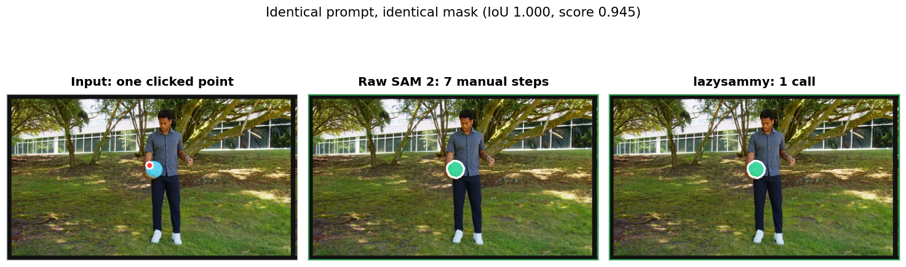
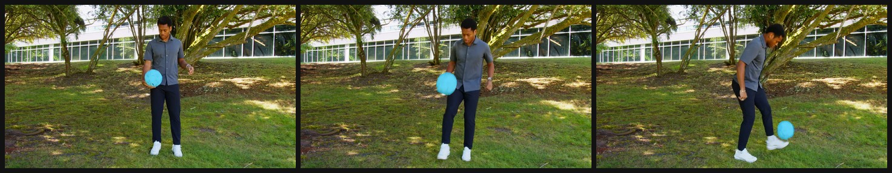

<p align="center">
  
</p>

<p align="center">
  <a href="LICENSE"></a>
  
  
  
  <a href="https://github.com/facebookresearch/sam2"></a>
  
</p>

# lazysammy

**A high-level, typed wrapper around [Meta's SAM 2](https://github.com/facebookresearch/sam2) for image segmentation and video object tracking.**

`lazysammy` gives you one small, well-typed API for the three things people
actually do with SAM 2 - segment an image, track an object through a video, and
auto-segment everything - without the research-codebase glue.

---

## Table of contents

- [Motivation](#motivation)
- [What you get](#what-you-get)
- [Installation](#installation)
- [Quick start](#quick-start)
- [Core workflows](#core-workflows)
- [API at a glance](#api-at-a-glance)
- [Result types](#result-types)
- [Advanced usage](#advanced-usage)
- [Notebooks and demo](#notebooks-and-demo)
- [Development](#development)
- [Contributing](#contributing)
- [Citation](#citation)
- [License](#license)

---

## Motivation

**SAM 2 is excellent. Its API is not.**

The model ships as a research codebase. The shortest path to a single mask means
building the model from a Hydra config string, locating a checkpoint, matching an
autocast dtype to the device, converting BGR to RGB, threading prompts through
`predict()`, taking `argmax` over the IoU scores, thresholding the logits, and
writing the PNG. Video is worse: three stateful calls whose outputs you
reassemble into per-frame, per-object structures by hand.

None of that is the interesting part of your project, and all of it is easy to
get quietly wrong. `lazysammy` removes that glue while leaving SAM 2 fully
intact. It is not a reimplementation and it does not simplify the model; it is a
thin, typed convenience layer, and the underlying predictors stay reachable
whenever you want to go deeper.

### The same task, both ways

Segment one point in an image and save the mask.

<table>
<tr>
<th align="left" width="50%">Raw SAM 2</th>
<th align="left" width="50%">lazysammy</th>
</tr>
<tr>
<td><code>7 steps | build, device, dtype, checkpoint, argmax, threshold, save</code></td>
<td><code>1 call | everything below is handled for you</code></td>
</tr>
<tr>
<td>

```python
import numpy as np
import torch
from PIL import Image
from sam2.build_sam import build_sam2
from sam2.sam2_image_predictor import (
    SAM2ImagePredictor,
)

# 1. Detect a device
device = "cuda" if torch.cuda.is_available() else "cpu"

# 2. Pick a matching autocast dtype
dtype = torch.bfloat16 if device == "cuda" else torch.float32

# 3. Build from a config string and a
#    checkpoint you fetched yourself
predictor = SAM2ImagePredictor(
    build_sam2(
        "configs/sam2.1/sam2.1_hiera_l.yaml",
        "sam2.1_hiera_large.pt",
        device=device,
    )
)

# 4. Load RGB (OpenCV hands you BGR)
image = np.array(Image.open("photo.jpg").convert("RGB"))

# 5. Predict
with torch.inference_mode(), torch.autocast(
    device, dtype=dtype
):
    predictor.set_image(image)
    masks, scores, logits = predictor.predict(
        point_coords=np.array([[100, 200]]),
        point_labels=np.array([1]),
        multimask_output=True,
    )

# 6. Choose the best mask yourself
best = int(np.argmax(scores))
binary = masks[best] > 0.0

# 7. Save
Image.fromarray((binary * 255).astype(np.uint8)).save("mask.png")
```

</td>
<td>

```python
from lazysammy import SAM2

# Device detection, autocast dtype, config
# and checkpoint resolution, RGB conversion,
# and best-mask selection: all handled.
sam = SAM2("large")

pred = sam.segment(
    "photo.jpg",
    points=[[100, 200]],
    labels=[1],
)

pred.best_mask.save("mask.png")
```

</td>
</tr>
</table>

<p align="center">
  
  <br/>
  <em>Same input, same mask: the two snippets above, run side by side.</em>
</p>

The steps that disappear (device detection, autocast dtype, config and
checkpoint resolution, BGR to RGB conversion, `argmax` over scores, logit
thresholding, format-specific saving) are exactly the steps that are easy to get
subtly wrong. The same shortcuts apply to video tracking and automatic mask
generation.

### What you get

- **One entry point:** `SAM2` covers images, video, and auto-mask generation
- **Typed, introspectable results:** not bare numpy tuples
- **Prompt ergonomics:** points, boxes, masks, and iterative refinement
- **Interactive picking:** click prompts straight onto a frame in a notebook
- **One-line export:** PNG, `.npy`, and COCO RLE
- **Portable runtime:** CUDA, Apple MPS, and CPU, auto-detected
- **Actually typed:** ships `py.typed` and passes `mypy --strict`

---

## Installation

Requires **Python 3.10+**. Uses [uv](https://docs.astral.sh/uv/).

```bash
git clone https://github.com/federicopozzi33/easier-sam2.git
cd easier-sam2
uv sync
```

Optional extras:

```bash
uv sync --extra viz       # matplotlib visualisation helpers
uv sync --extra notebook  # jupyterlab + ipympl (for interactive clicking)
uv sync --extra demo      # gradio demo app
uv sync --extra all       # everything above
```

Development tools (pytest, ruff, mypy) live in the `dev` dependency group and
are installed by a plain `uv sync`:

```bash
uv sync                  # includes the dev group
uv sync --no-dev         # runtime dependencies only
```

> `lazysammy` depends on SAM 2 directly from Meta's repository, so it is
> distributed via git rather than PyPI. CUDA is recommended for speed, but MPS
> and CPU are fully supported. Weights are downloaded from HuggingFace on first
> use and cached locally.

---

## Quick start

```python
from lazysammy import SAM2

sam = SAM2("large")  # also: "tiny", "small", "base_plus"
```

### Segment an image

```python
pred = sam.segment("photo.jpg", points=[[100, 200]], labels=[1])

print(pred.best_mask.score)   # model IoU estimate
print(pred.best_mask.area)    # pixel area
pred.best_mask.save("mask.png")
```

### Track an object through a video

```python
# Accepts a frame directory *or* a video file (frames auto-extracted)
session = sam.video("clip.mp4")

session.add_points(frame_idx=0, obj_id=1, points=[[150, 300]], labels=[1])
results = session.propagate()

session.save("output/masks/")               # PNG masks
session.save_overlay("output/overlay.mp4")  # annotated video
```

### Auto-segment everything

```python
auto = sam.auto_segment("photo.jpg")

print(len(auto))                        # number of masks found
good = auto.filter_by_iou(min_iou=0.9)  # keep confident masks
sam.save(good, "output/auto_masks/")
```

---

## Core workflows

### Image prompts and refinement

```python
pred = sam.segment("photo.jpg", box=[50, 60, 300, 400])

# Convenience shortcuts
pred = sam.segment_point("photo.jpg", x=100, y=200)
pred = sam.segment_box("photo.jpg", 50, 60, 300, 400)

# One box per object, in a single pass
preds = sam.segment_multi_box(
    "photo.jpg",
    boxes=[[50, 60, 300, 400], [400, 100, 600, 350]],
)

# Iterative refinement: feed the previous logits back in
pred1 = sam.segment_point("photo.jpg", x=100, y=200)
pred2 = sam.refine(
    "photo.jpg",
    pred1.best_mask.logits,
    points=[[120, 180]],
    labels=[0],  # exclude this point
)
```

### Video tracking

```python
session = sam.video("path/to/frames/", every_n=1)

# Multiple objects, multiple prompt types, any frame
session.add_points(frame_idx=0, obj_id=1, points=[[220, 340]], labels=[1])
session.add_box(frame_idx=0, obj_id=2, box=[410, 220, 590, 470])

# Correct a drifted object later in the sequence
session.add_points(frame_idx=12, obj_id=1, points=[[205, 355]], labels=[0])

results = session.propagate()

person = results.get_object_masks(obj_id=1)  # {frame_idx: mask}
print(f"Tracked on {len(person)} frames")
```

If your earliest prompt is **mid-video**, track in both directions:

```python
results = session.propagate_bidirectional()
```

### Managing session state

```python
session.remove_object(obj_id=2)                     # drop an object
session.clear_frame_prompts(frame_idx=0, obj_id=1)  # drop prompts on a frame
session.reset()                                     # start over
```

---

## API at a glance

| Area | Call | Returns |
|------|------|---------|
| Image segmentation | `sam.segment(...)` | `ImagePrediction` |
| Batched images | `sam.segment_batch([...])` | `list[ImagePrediction]` |
| Many prompts, one image | `sam.set_image(...)` + `sam.predict(...)` | `ImagePrediction` |
| Multiple objects by points | `sam.segment_multi_point(...)` | `list[ImagePrediction]` |
| Refinement | `sam.refine(...)` | `ImagePrediction` |
| Auto-segmentation | `sam.auto_segment(...)` | `AutoMaskResult` |
| Start a video session | `sam.video(...)` | `VideoSession` |
| Propagate | `session.propagate(...)` | `VideoResults` |
| Save any image result | `sam.save(result, dir, fmt=...)` | output path |
| Save video results | `session.save(dir, fmt=...)` | output path |

---

## Result types

Every result is a typed dataclass you can inspect, iterate, and serialise.

| Type | Description |
|------|-------------|
| `Mask` | Binary mask with `.score`, `.area`, `.logits`, `.bbox`, `.centroid`, `.iou()`, `.numpy()`, `.as_uint8()`, `.to_rle()`, `.save()` |
| `ImagePrediction` | Masks from one image call; iterable, indexable, `.best_mask` is the highest-scoring one |
| `AutoMask` | One auto-generated mask with area, bbox, and stability score |
| `AutoMaskResult` | Iterable collection with `.filter_by_area()` / `.filter_by_iou()` / `.sort_by()` |
| `FrameMasks` | Object masks for one video frame; `.object_ids`, `.masks` |
| `VideoResults` | Full tracked sequence; iterable, indexable, sliceable, `.get_object_masks()` |

```python
from lazysammy import AutoMask, AutoMaskResult, FrameMasks, ImagePrediction, Mask, VideoResults
```

Masks support set operations and geometry directly:

```python
union = pred.masks[0] | pred.masks[1]   # Mask
overlap = pred.masks[0] & pred.masks[1]  # Mask
inverse = ~pred.best_mask                # Mask
print(pred.best_mask.bbox)               # [x_min, y_min, x_max, y_max]
print(pred.best_mask.centroid)           # (x, y)
print(pred.masks[0].iou(pred.masks[1]))  # float
```

Every result type round-trips through JSON-friendly dicts (masks as COCO RLE):

```python
import json

payload = json.dumps(pred.to_dict())
restored = ImagePrediction.from_dict(json.loads(payload))
```

---

## Advanced usage

### Model, device, and performance

```python
sam = SAM2("large")        # aliases: tiny, small, base_plus
sam = SAM2("l")            # short aliases: t, s, b+, l, b
sam = SAM2("large", checkpoint="/path/to/sam2.1_hiera_large.pt")

sam = SAM2("large", device="cuda:1")   # explicit CUDA device
sam = SAM2("large", device="mps")      # Apple Silicon
sam = SAM2("large", device="cpu")      # CPU

# torch.compile the model for faster video inference (CUDA + PyTorch >= 2.5.1)
sam = SAM2("large", vos_optimized=True)

# Inspect the resolved configuration
print(sam.model_size, sam.device, sam.vos_optimized)
```

### Tuning automatic mask generation

```python
auto = sam.auto_segment(
    "photo.jpg",
    points_per_side=64,         # denser sampling grid
    pred_iou_thresh=0.9,        # stricter quality gate
    stability_score_thresh=0.95,
    min_mask_region_area=100,   # drop specks
    use_m2m=True,               # mask-to-mask refinement
)
```

> Tuned settings are cached per configuration, so repeated calls with the same
> options reuse the loaded model instead of rebuilding it.

### Use sub-components directly

Instantiate only the piece you need when the full facade is unnecessary:

```python
from lazysammy import AutoSegmenter, ImageSegmenter, VideoTracker

img_seg = ImageSegmenter("large", device="cuda")
vid_tracker = VideoTracker("large", device="cuda", vos_optimized=True)
auto_seg = AutoSegmenter("large", points_per_side=32)
```

### Export formats

```python
sam.save(pred, "out/", fmt="png")       # one PNG per mask
sam.save(pred, "out/", fmt="npy")       # one .npy per mask
sam.save(pred, "out/", fmt="coco_rle")  # one COCO-RLE .json per mask

# Lower-level helpers
from lazysammy import save_masks_as_coco_rle, save_masks_as_npy, save_masks_as_png
```

### Visualisation

```python
from lazysammy import (
    draw_box_on_image,
    draw_masks_on_image,
    draw_points_on_image,
    masks_to_colored_overlay,
    save_video_overlay,
    save_video_overlay_mp4,
    show_auto_masks,
    show_image_prediction,
    show_video_frame,
)
```

### Mask utilities

```python
from lazysammy import combine_masks, mask_iou, mask_to_bbox, mask_to_rle, rle_to_mask

union = combine_masks(pred.numpy())     # (N, H, W) -> (H, W)
box = mask_to_bbox(pred.best_mask.data) # [x_min, y_min, x_max, y_max]
overlap = mask_iou(pred.masks[0].data, pred.masks[1].data)

rle = mask_to_rle(pred.best_mask.data)  # COCO RLE dict
mask = rle_to_mask(rle)                 # back to a boolean array
```

### Many prompts on one image

Encoding an image is the expensive part. `set_image()` encodes once and
`predict()` reuses the embedding, so iterative prompting does not re-run the
image encoder:

```python
sam.set_image("photo.jpg")

p1 = sam.predict(points=[[100, 200]], labels=[1])
p2 = sam.predict(points=[[120, 180]], labels=[0])   # no re-encoding

# Or segment several objects in one pass
preds = sam.segment_multi_point(
    "photo.jpg",
    points_per_object=[[[100, 200]], [[400, 300], [410, 310]]],
)
```

> `segment()` and `refine()` also reuse the cached embedding automatically when
the same image is passed again.

### Interactive prompt picking (notebooks)

```python
from lazysammy import PromptPicker, is_interactive_backend, preview_frame

# preview_frame() works on any backend; picking needs an interactive one
if not is_interactive_backend():
    print("Use %matplotlib widget for click-based prompts")

picker = PromptPicker(session)
picker.preview(frame_idx=0)
picker.add_points_interactive(frame_idx=0, obj_id=1)  # click to prompt
picker.add_box_interactive(frame_idx=0, obj_id=2)
```

### Working with a video file

```python
session = sam.video(
    "clip.mp4",
    every_n=2,                  # keep every 2nd frame
    max_frames=200,             # stop after 200
    frames_dir="my_frames/",    # where to extract (default: <stem>_frames/)
    clean=True,                 # clear stale frames when re-extracting
    offload_video_to_cpu=True,  # lower GPU memory
)
```

> Extracted frames are reused across runs, so re-extracting with a different
> `every_n` or `max_frames` into the same directory would otherwise mix the two
> runs. Pass `clean=True` to start from a clean directory; the library also
> warns if it detects this situation.

### Memory tips

| Goal | How |
|------|-----|
| Use a smaller model | `SAM2("tiny")` or `SAM2("small")` |
| Offload frames | `sam.video(path, offload_video_to_cpu=True)` |
| Offload state | `sam.video(path, offload_state_to_cpu=True)` |
| Subsample frames | `sam.video("clip.mp4", every_n=3)` |
| Limit propagation | `session.propagate(max_frames=100)` |
| Free the model | `del sam` |

---

## Notebooks and demo

### Notebook

```bash
uv sync --extra notebook
uv run jupyter lab
```

Then open [`examples/video_tracking.ipynb`](examples/video_tracking.ipynb) and
run the cells in order. It covers loading a clip, interactive and manual prompt
placement, forward and bidirectional propagation, inspecting and saving results,
and managing objects mid-sequence.

> Interactive clicking requires `%matplotlib widget`, enabled in the notebook's
> setup cell (it comes from `ipympl`, installed by the `notebook` extra). With
> `%matplotlib inline` plots still render but clicks do not register. The
> notebook detects this and warns you.

### Gradio demo

```bash
uv sync --extra demo
uv run python demo/app.py
```

Then open <http://localhost:7860>. The demo has three tabs:

- **Image Segmentation:** click points or drag a box directly on the image
- **Auto Segment:** segment everything, with area and IoU filters
- **Video Tracking:** upload a clip, click prompts on frames, render an overlay

<p align="center">
  
  <br/>
  <em>The bundled Gradio demo.</em>
</p>

---

## Development

```bash
uv sync

# Lint and format
uv run ruff check src/ tests/ demo/ scripts/
uv run ruff format --check src/ tests/ demo/ scripts/

# Types (strict)
uv run mypy src/

# Fast unit tests (no model weights required)
uv run pytest

# End-to-end tests with real SAM 2 weights
uv run pytest -m integration
```

Integration tests use the `small` model by default. Override with
`LAZYSAMMY_TEST_MODEL=tiny`, and set `HF_HUB_OFFLINE=1` to require weights that
are already cached.

Two helper scripts keep generated artifacts reproducible from checked-in source:

```bash
# Regenerate examples/video_tracking.ipynb from scripts/build_notebook.py
uv run python scripts/build_notebook.py

# Regenerate the README comparison figure from real model runs
uv run python scripts/make_comparison.py
```

---

## Contributing

Contributions are welcome. Please read [CONTRIBUTING.md](CONTRIBUTING.md) for
the development setup, the checks that must pass before a pull request, and the
project's design guidelines (keep the abstraction thin, validate at the
boundary, add a regression test with every fix).

For security issues, follow [SECURITY.md](SECURITY.md) instead of opening a
public issue.

---

## Citation

If you use `lazysammy` in academic work, please cite the underlying SAM 2 paper:

```bibtex
@article{ravi2024sam2,
  title   = {SAM 2: Segment Anything in Images and Videos},
  author  = {Ravi, Nikhila and Gabeur, Valentin and Hu, Yuan-Ting and others},
  journal = {arXiv preprint arXiv:2408.00714},
  year    = {2024}
}
```

---

## License

`lazysammy` wraps SAM 2, which is licensed under the
[Apache 2.0 License](https://github.com/facebookresearch/sam2/blob/main/LICENSE).
This project is released under the same license. See [LICENSE](LICENSE).
